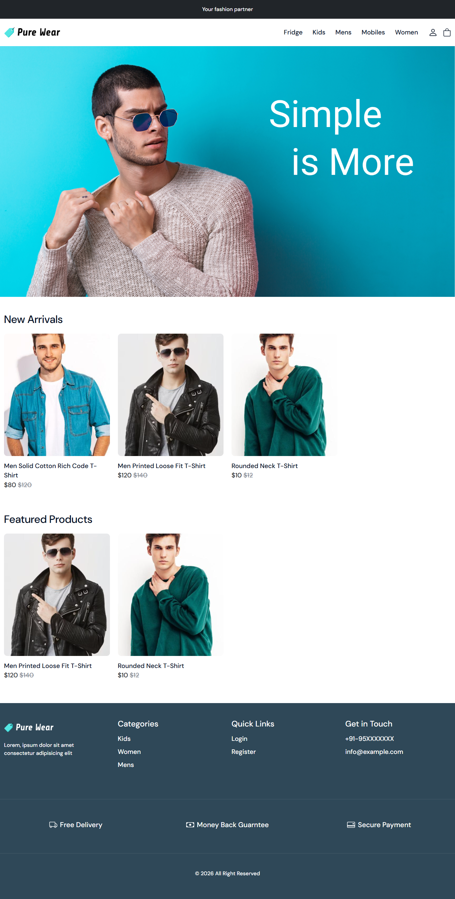
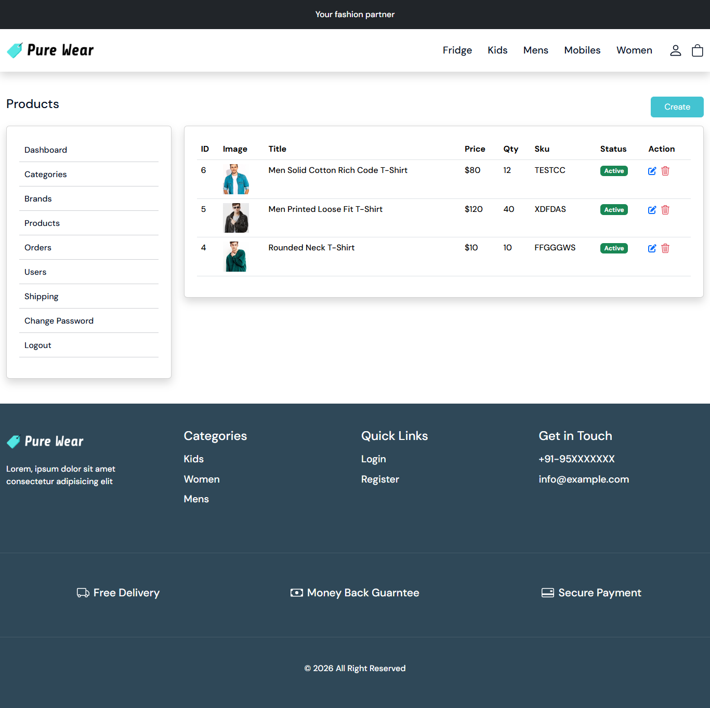
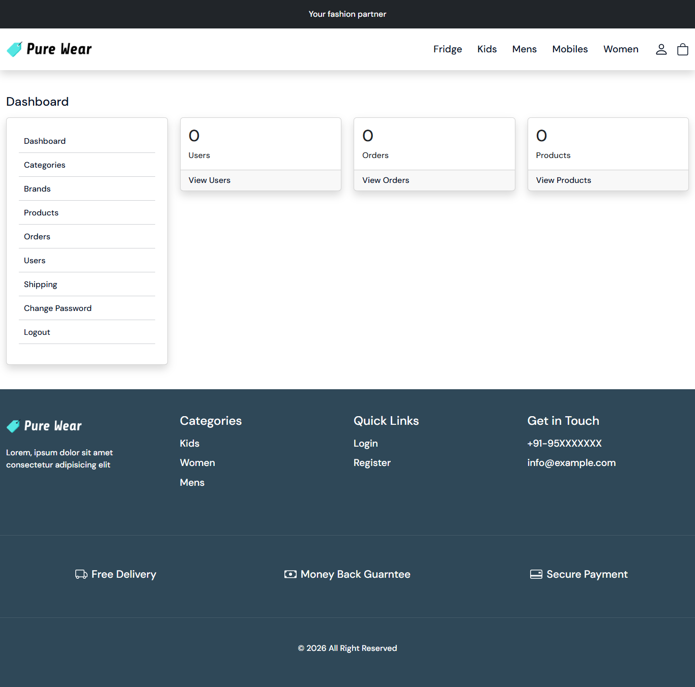

# Laravel + React E-Commerce Project

A full stack E-Commerce web application built with **Laravel 12** (Backend API) and **React 19** (Frontend).  
This project includes product management, authentication, image upload, ratings, and modern UI components.

---

# 🚀 Tech Stack

## Backend
- Laravel 12
- PHP 8.2+
- Laravel Sanctum (API Authentication)
- Intervention Image (Image Processing)
- MySQL

## Frontend
- React 19
- React Router DOM
- React Hook Form
- Bootstrap 5
- React Bootstrap
- React Toastify
- Swiper
- Jodit React Editor
- React Simple Star Rating

---

# 📦 Backend Dependencies

```json
{
  "php": "^8.2",
  "intervention/image": "^3.11",
  "laravel/framework": "^12.0",
  "laravel/sanctum": "^4.0",
  "laravel/tinker": "^2.10.1"
}
```

---

# 📦 Frontend Dependencies

```json
{
  "bootstrap": "^5.3.8",
  "jodit-react": "^5.3.21",
  "react": "^19.2.0",
  "react-bootstrap": "^2.10.10",
  "react-dom": "^19.2.0",
  "react-hook-form": "^7.71.2",
  "react-router-dom": "^7.13.1",
  "react-simple-star-rating": "^5.1.7",
  "react-toastify": "^11.0.5",
  "swiper": "^12.1.2"
}
```

---

# ⚙️ Environment Setup

Create a `.env` file in the backend root directory.

```env
APP_NAME=Laravel
APP_ENV=local
APP_KEY=
APP_DEBUG=true
APP_URL=http://localhost

APP_LOCALE=en
APP_FALLBACK_LOCALE=en
APP_FAKER_LOCALE=en_US

BCRYPT_ROUNDS=12

LOG_CHANNEL=stack
LOG_LEVEL=debug

DB_CONNECTION=mysql
DB_HOST=127.0.0.1
DB_PORT=3306
DB_DATABASE=ecommerce_project
DB_USERNAME=root
DB_PASSWORD=root

SESSION_DRIVER=database
SESSION_LIFETIME=120

FILESYSTEM_DISK=local
QUEUE_CONNECTION=database
CACHE_STORE=database

MAIL_MAILER=log

REDIS_CLIENT=phpredis
REDIS_HOST=127.0.0.1
REDIS_PORT=6379

VITE_APP_NAME="${APP_NAME}"
```

---

# 📥 Installation Guide

## 1️⃣ Clone Repository

```bash
git clone https://github.com/skrsabbih/laravel_react_ecommerce_project.git
cd laravel_react_ecommerce_project
```

---

# 🛠 Backend Setup

```bash
cd backend

composer install

cp .env.example .env

php artisan key:generate

php artisan migrate

php artisan serve
```

Backend will run on

```
http://127.0.0.1:8000
```

---

# 💻 Frontend Setup

```bash
cd frontend

npm install

npm run dev
```

Frontend will run on

```
http://localhost:5173
```

---

# ✨ Features

- User Authentication (Laravel Sanctum)
- Product Management
- Image Upload & Processing
- Rich Text Editor (Jodit)
- Product Rating System
- Toast Notifications
- Modern UI with Bootstrap
- Responsive Design
- API Based Architecture

---

# 📸 Project Screenshots

### 🏠 Home Page


---

### 📦 Product Page


---

### ⚙️ Admin Dashboard


---

# 👨‍💻 Author

**Sabbih Sarker**

GitHub  
https://github.com/skrsabbih

---

# 📄 License

This project is open-source and available under the MIT License.
